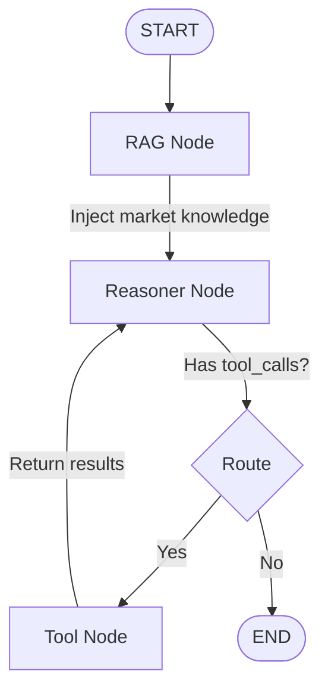
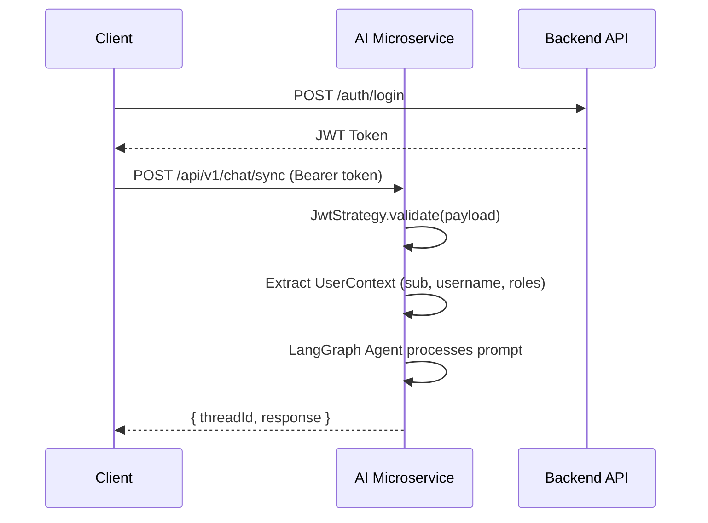

# RealVista AI — Architecture

## System Context

The **RealVista AI Microservice** is a standalone NestJS service within the RealVista ecosystem. It provides AI-powered real estate consultation through a **LangGraph agentic workflow** that orchestrates tool-calling, RAG retrieval, and multi-step reasoning.

```
┌──────────────┐     Headers  ┌──────────────────┐    REST     ┌─────────────────┐
│  Web / Mobile │ ──────────▶ │  AI Microservice  │ ─────────▶ │  Backend API    │
│  Frontend     │ ◀────────── │  (this repo)      │ ◀───────── │  (Spring Boot)  │
└──────────────┘   SSE/JSON   │                   │            └─────────────────┘
                               │                   │
                               │                   │    REST     ┌─────────────────┐
                               │                   │ ─────────▶ │  Qdrant         │
                               └──────────────────┘ ◀───────── │  (Vector DB)    │
                                        │                       └─────────────────┘
                                        │
                                        ▼
                                  ┌─────────────────────────────┐
                                  │          Google AI          │
                                  │ gemini-3.1-flash-lite-preview │
                                  └─────────────────────────────┘
```

### Data Flow

1. **Client** sends a chat prompt with a JWT token.
2. **AI Microservice** validates the JWT, extracts user context (roles, ID).
3. **LangGraph Agent** processes the prompt through a multi-node workflow (RAG → Reasoner → Tools → Reasoner loop).
4. The agent calls **Backend API** tools for property data, price predictions, and recommendations.
5. The agent queries **Qdrant** for RAG context (market insights, FAQs).
6. Final response is returned as JSON (sync) or streamed via SSE (stream).

---

## Directory Structure

```
src/
├── ai/                          # AI Feature Module
│   ├── ai.module.ts             # Module definition
│   ├── ai.controller.ts         # REST + SSE endpoints
│   ├── dto/
│   │   └── chat-query.dto.ts    # Request validation DTO
│   ├── interfaces/
│   │   ├── index.ts             # Barrel exports
│   │   ├── user-context.interface.ts    # Authenticated user shape
│   │   ├── jwt-payload.interface.ts     # Raw JWT payload shape
│   │   └── stream-event.interface.ts    # LangGraph SSE event shape
│   ├── services/
│   │   ├── ai.service.ts        # Orchestrates sync/stream processing
│   │   ├── lang-graph.service.ts # LangGraph workflow builder
│   │   └── tools.service.ts     # LangChain tool definitions (RBAC)
│   └── state/
│       └── agent.state.ts       # AgentState interface for LangGraph
├── auth/                        # Authentication Module
│   ├── auth.module.ts           # Passport + JWT config
│   ├── auth.service.ts          # Auth service (placeholder)
│   ├── guards/
│   │   └── jwt-auth/
│   │       └── jwt-auth.guard.ts
│   └── jwt.strategy/
│       └── jwt.strategy.ts      # JWT validation → UserContext
├── decorators/
│   └── user/
│       └── user.decorator.ts    # @User() param decorator
├── app.module.ts                # Root module
├── app.controller.ts            # Health check endpoint
├── app.service.ts
└── main.ts                      # Bootstrap + Swagger setup
```

---

## LangGraph Agent Workflow

The core AI logic is an **agentic state machine** built with LangGraph:



### Nodes

| Node         | Responsibility                                                             |
| ------------ | -------------------------------------------------------------------------- |
| **RAG**      | Retrieves relevant market insights from Qdrant vector DB                   |
| **Reasoner** | LLM (GPT-4o-mini) reasoning with system prompt + user context              |
| **Tools**    | Executes tool calls (search DB, predict price, get comps, recommendations) |

### State (`AgentState`)

| Field               | Type            | Description                                    |
| ------------------- | --------------- | ---------------------------------------------- |
| `messages`          | `BaseMessage[]` | Full conversation history (accumulated)        |
| `userContext`       | `UserContext`   | JWT-extracted user info (sub, username, roles) |
| `extractedEntities` | `object`        | Location, price range, property type entities  |
| `currentStep`       | `string`        | Current workflow step indicator                |

---

## Authentication Flow

This microservice **does not manage users** — it trusts the JWT issued by the main Backend API.



---

## API Endpoints

| Method | Path         | Auth    | Description                                   |
| ------ | ------------ | ------- | --------------------------------------------- |
| `POST` | `/ai/chat`   | API Key | Synchronous AI chat — returns full response   |
| `POST` | `/ai/stream` | API Key | SSE streaming — real-time token + tool events |
| `GET`  | `/`          | None    | Health check                                  |
| `GET`  | `/api/docs`  | None    | Swagger UI documentation                      |

---

## Available Tools (RBAC)

| Tool                        | Description                             | Roles |
| --------------------------- | --------------------------------------- | ----- |
| `search_property_database`  | Query listings by location, price, type | All   |
| `predict_property_price`    | AI price estimation for a property      | All   |
| `get_comparable_properties` | Recently sold comparable properties     | All   |
| `get_recommendations`       | Personalized property recommendations   | All   |

---

## Tech Stack

| Layer            | Technology                     |
| ---------------- | ------------------------------ |
| Framework        | NestJS 11                      |
| AI Orchestration | LangGraph + LangChain          |
| LLM              | Google Gemini 3.1 Flash Lite   |
| Embeddings       | Google Generative AI (Gemini)  |
| Vector DB (RAG)  | Qdrant                         |
| Auth             | API Key + User Context Headers |
| Monitoring       | LangSmith                      |
| API Docs         | Swagger / OpenAPI              |
| Language         | TypeScript 5 (strict mode)     |
